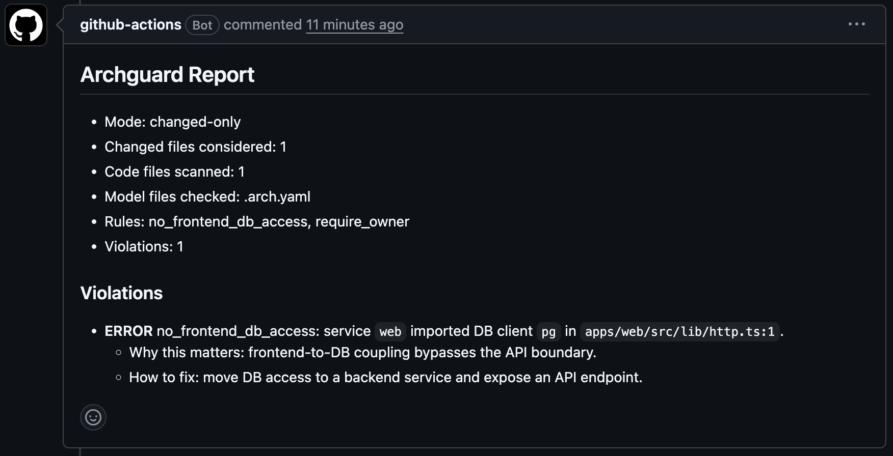
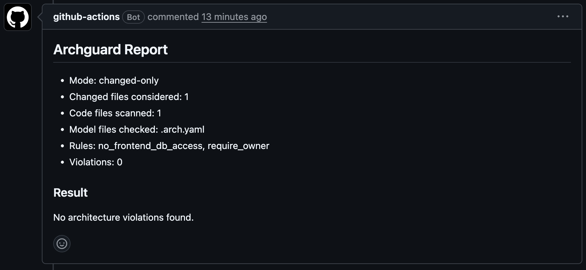

# archguard (PR-first)

Minimal Architecture-as-Code tool focused on deterministic PR guardrails in GitHub Actions.

See `ROADMAP.md` for planned milestones and priorities.
See `docs/ROADMAP_GTM.md` for user-facing rollout plan.
See `docs/ADOPTION_CHECKLIST.md` for first 10 installs tracking.

## 30-second quickstart

```bash
npx @nahuelorselli/archguard init --yes
npx @nahuelorselli/archguard doctor
npx @nahuelorselli/archguard check
```

Expected result:

- `doctor` reports 0 errors on a valid config
- `check` reports architecture violations only when rules are broken

## What this MVP does

- Reads architecture model from `.archguard.yaml`
- Maps service paths in the repo
- Enforces rules: `no_frontend_db_access`, `require_owner`
- Posts a report in pull requests
- Fails CI when the rule is violated

## Rule demo

If any file inside a frontend service imports one of these DB clients, CI fails:

- `@prisma/client`
- `pg`
- `mysql2`
- `mongodb`

`require_owner` fails when a service in `.archguard.yaml` has no `owner`.

Customize DB client detector packages in config:

```yaml
detectors:
  db_client_packages_mode: extend
  db_client_packages:
    - drizzle-orm
    - knex
    - typeorm
```

Add custom path-boundary guardrails without changing Archguard code:

```yaml
rule_templates:
  - id: no-web-imports-from-api
    type: no_path_imports
    from: apps/web/**
    deny_import: apps/api/**
    severity: error
```

## Fast onboarding

Create a starter `.archguard.yaml` from your repo layout:

```bash
npx @nahuelorselli/archguard init
```

By default it discovers folders under `apps/*` and `services/*`.
`archguard check` auto-discovers config in this order: `.archguard.yaml`, `.archguard.yml`, `.arch.yaml`, `.arch.yml`.

Useful init flags:

```bash
npx @nahuelorselli/archguard init --yes
npx @nahuelorselli/archguard init --preset minimal --root src
npx @nahuelorselli/archguard init --config .archguard.yaml --force
```

Validate config and paths:

```bash
npx @nahuelorselli/archguard doctor
```

Share first-install feedback in:

- `New issue -> Try Archguard (First install feedback)`

## Install and run

No global install required:

```bash
npx @nahuelorselli/archguard check
pnpm dlx @nahuelorselli/archguard check
bunx @nahuelorselli/archguard check
```

## Local development

```bash
npm install
npm run archguard
npm run archguard:doctor
```

Changed files mode:

```bash
npm run archguard:changed
```

## GitHub Actions run

Workflow file: `.github/workflows/archguard.yml`

On each PR, the workflow:

1. runs archguard on changed files
2. writes `archguard-report.md`
3. comments the report in the PR
4. fails the job if violations exist

## End-to-end demo scenario

### PR that should fail

1. Edit `apps/web/src/lib/http.ts`
2. Add:

```ts
import { PrismaClient } from '@prisma/client'
```

3. Open PR
4. Expected: PR comment with violation + failed check

### PR that should pass

1. Remove DB client import from frontend
2. Keep DB access in `apps/api`
3. Push update
4. Expected: passing check and clean report

## Report output

Each violation includes:

- exact file (and line for code imports)
- why the change is risky
- how to fix it

## Live demo PRs

- Expected fail (frontend DB access): `https://github.com/NahuelOrselli/archguard/pull/6`
- Expected pass (safe API-only change): `https://github.com/NahuelOrselli/archguard/pull/5`

## Demo screenshots

### Expected fail



### Expected pass


